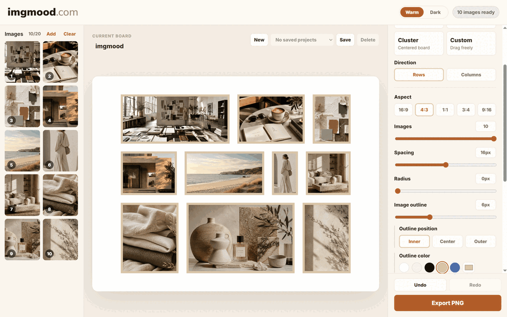
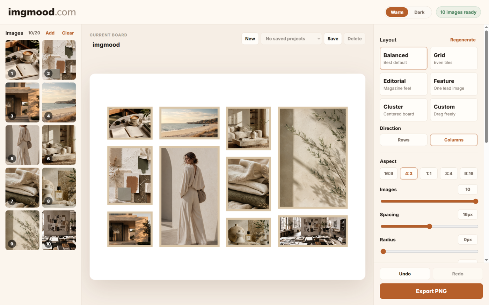
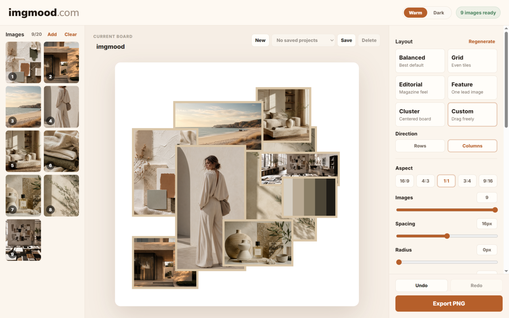
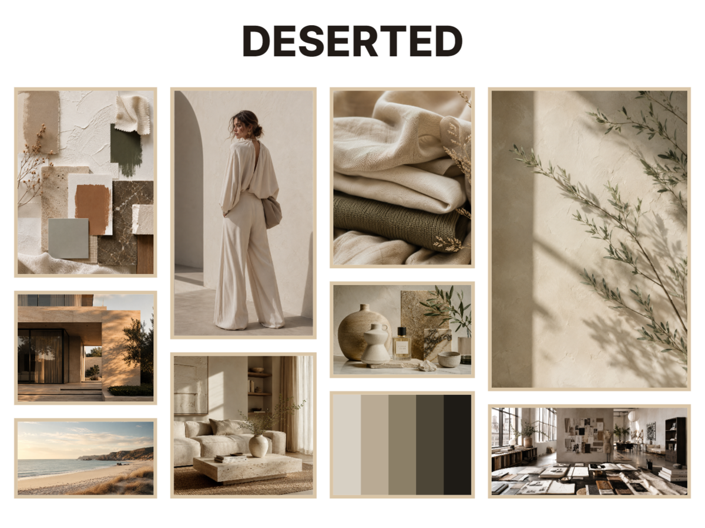

# imgmood

imgmood is a browser-based image board maker for moodboards, collages, visual references, and product boards. Drop in images, choose a layout, tune the style, and export a polished PNG or PDF without uploading anything to a server.

Live demo: https://imgmood.com

## Highlights

- Fully client-side image loading, layout, palette extraction, editing, and export
- Drag and drop upload for up to 20 JPG, PNG, or WEBP images
- Balanced, grid, editorial, feature, cluster, and custom layouts
- Custom layout mode with drag positioning, multi-select, resize, and crop controls
- Optional palette tile with editable colors and multiple palette styles
- Background, spacing, radius, outline, title, aspect ratio, and export quality controls
- Saved projects in browser storage
- Undo and redo for board edits
- PNG and PDF export

## Screenshots









## Privacy

imgmood runs in the browser. Images are processed locally and are not uploaded by the app. Saved projects are stored in the browser's local storage/IndexedDB for the current site.

## Run Locally

Install dependencies once, then start the Vite dev server.

```bash
npm install
npm run dev
```

## Build

```bash
npm run build
```

The production build is written to `dist/`.

## Deploy

This is a static Vite app and can be deployed to Vercel, Netlify, Cloudflare Pages, or GitHub Pages.

For Vercel:

- Build command: `npm run build`
- Output directory: `dist`

## Tech Stack

- React
- TypeScript
- Vite
- Canvas API
- IndexedDB

## Status

First public/demo release candidate.
